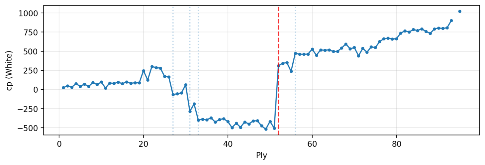
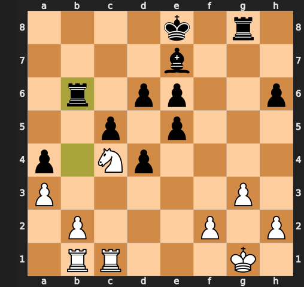

# ♟️ ChessCoach — PGN Analyzer (Stockfish + Streamlit)

[](LICENSE)
[](https://www.python.org/)
[](https://streamlit.io/)
[](https://python-chess.readthedocs.io/)

Analyse tes parties d'échecs à partir de fichiers **PGN** grâce à **Stockfish** et une interface **Streamlit** simple et intuitive.  
L’objectif : **identifier les erreurs, les coups clés et visualiser les performances** d’un joueur sur une ou plusieurs parties.

---

## Table des matières
1. [Aperçu](#-aperçu)
2. [Fonctionnalités](#-fonctionnalités)
3. [Installation](#-installation)
4. [Configuration de Stockfish](#️-configuration-de-stockfish)
5. [Lancer l’application](#-lancer-lapplication)
6. [Structure du projet](#-structure-du-projet)
7. [Exemples et Captures](#-exemples-et-captures)
8. [Roadmap](#-roadmap)
9. [Contribuer](#-contribuer)
10. [Licence](#-licence)
11. [Remerciements](#-remerciements)

---

## Aperçu

**ChessCoach** te permet de :
- Charger un ou plusieurs fichiers **.pgn** de parties d’échecs.
- Lancer une **analyse automatique** via le moteur **Stockfish**.
- Visualiser le score d’évaluation et les erreurs coup par coup.
- Exporter les résultats pour un suivi de performance.

> 💡 Idéal pour comprendre ses erreurs sans dépendre de Chess.com ou Lichess.


## Exemples 


### Interface

<p align="center">
  
</p>


### Stats de la partie

<p align="center">
  
</p>


### Evolution du score au cours de la partie

<p align="center">
  
</p>


### Plus grosse erreur de la partie

<p align="center">
  
</p>


---

## Fonctionnalités

-  **Import de fichiers PGN**
-  **Analyse automatisée par Stockfish** (profondeur ajustable)
-  **Scores d’évaluation** et suggestions de meilleurs coups
-  **Visualisations dynamiques** (score, erreurs, etc.)
-  **Export CSV / Parquet**
-  **Détection automatique** des blunders, mistakes, inaccuracies
-  Interface **Streamlit** claire et fluide

---

## Installation

### 1️ Cloner le dépôt
```bash
git clone https://github.com/tsauffisseau/chesscoach.git
cd chesscoach
```

### 2️ Créer l’environnement Conda
```bash
conda env create -f environment.yml
conda activate chesscoach
```

ou avec pip :
```bash
python -m venv .venv
.venv\Scripts\activate
pip install -r requirements.txt
```

---

## Configuration de Stockfish

Télécharge le moteur Stockfish depuis :  
 https://stockfishchess.org/download/

Puis indique son chemin dans ton environnement :
```bash
# Exemple sous PowerShell :
$env:ENGINE_PATH="C:\Users\thsau\dossier\stockfish\stockfish.exe"
```

Tu peux aussi définir ce chemin directement dans la barre latérale Streamlit de l’app.

---

## Run - Lancer l’application

À la racine du projet :
```bash
pip install -e .
streamlit run ui/streamlit_app.py
```

Pour les utilisateurs sur Windows, le fichier run.bat peut etre un raccourci
Puis le lien local (`http://localhost:8501`) s'ouvre dans ton navigateur.


[ Télécharger l'exemple PGN](data_pgn/partie1.pgn)


---

##  Structure du projet

```
chesscoach/
├── data_pgn/               # Exemples de parties (.pgn)
│   ├── partie1.pgn
│   └── partie2.pgn
├── src/chesscoach/
│   ├── __init__.py
│   ├── analysis.py         # Analyse PGN + moteur
│   ├── engine.py           # Gestion Stockfish
│   ├── parse_pgn.py        # Parsing PGN
│   ├── detectors.py        # Détection d’erreurs
│   ├── eval_signals.py     # Génération des signaux
│   ├── stats.py            # Calculs statistiques
│   └── viz/
│       └── render.py       # Visualisation
├── ui/
│   └── streamlit_app.py    # Interface Streamlit
├── environment.yml
├── requirements.txt
├── LICENSE
└── README.md
```

---

## Où j'en suis - Roadmap

- [x] Analyse PGN via Stockfish  
- [x] Interface Streamlit fonctionnelle  
- Export PDF du rapport d’analyse de la partie : En cours
- [ ] Statistiques multi-parties pour un compte 
- [ ] Mode “coach interactif” et exercices
- [ ] Hébergement Streamlit Cloud  

---

## Contribuer

Les contributions sont bienvenues !  

1. Forke le projet  
2. Crée une branche :  
   ```bash
   git checkout -b feature/ma-fonctionnalite
   ```
3. Commit :  
   ```bash
   git commit -m "feat: nouvelle fonctionnalité"
   ```
4. Push :  
   ```bash
   git push origin feature/ma-fonctionnalite
   ```
5. Ouvre une **Pull Request**

---

## Licence

Ce projet est sous licence [MIT](LICENSE).

```
MIT License © tsauffisseau - Théophile Sauffisseau - 2025
```

Tu peux librement **utiliser, modifier et redistribuer** ce projet à condition de mentionner l’auteur original.

---

## Remerciements

- [python-chess](https://python-chess.readthedocs.io/)
- [Stockfish](https://stockfishchess.org/)
- [Streamlit](https://streamlit.io/)
- Communauté open source

---

> Projet développé par tsauffisseau - Théophile Sauffisseau<br>

> *(Machine Learning Engineer Student, 2025)*
